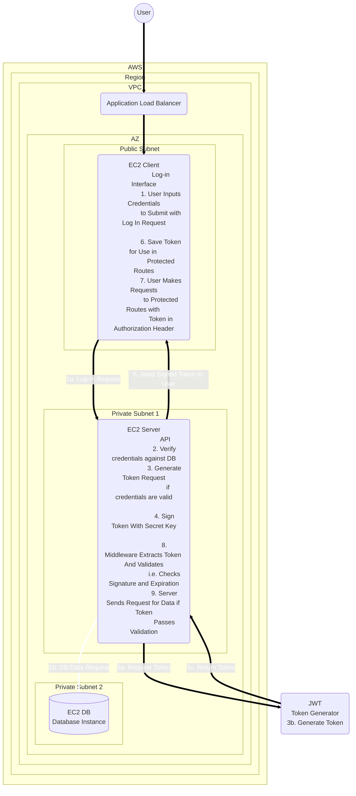

```mermaid
graph TD
    subgraph AWS
        subgraph Region
            subgraph VPC
                ALB(Application Load Balancer) --> Client
                
                subgraph AZ

                subgraph Public Subnet
                    Client(EC2 Client
                    Log-in Interface
                    1. User Inputs Credentials
                    to Submit with Log In Request

                    6. Save Token for Use in 
                    Protected Routes
                    7. User Makes Requests
                    to Protected Routes with 
                    Token in Authorization Header)
                end

                subgraph Private Subnet 1
                    Server(EC2 Server
                        API
                        2. Verify credentials against DB
                        3. Generate Token Request
                            if credentials are valid

                        4. Sign Token With Secret Key
                        
                        8. Middleware Extracts Token And Validates
                        i.e. Checks Signature and Expiration
                        9. Server Sends Request for Data if Token
                        Passes Validation) 
                end

                subgraph Private Subnet 2
                    DB[(EC2 DB
                        Database Instance
                    )]
                end

            end
        end
    end
end

JWT(JWT
    Token Generator
    3b. Generate Token)
User((User))


Server -- 3a. Request Token --> JWT
JWT -- 3c. Return Token --> Server
Client --1a. Log-In Request--> Server
Server --10. DB Data Request --> DB
User ---> ALB
Server -- 5. Send Signed Token to User ---> Client
linkStyle 0,1,2,3,4,5,6 stroke:black,stroke-width:4px,color:white;
linkStyle 4 stroke:white,stroke-width:4px,color:white;
```
