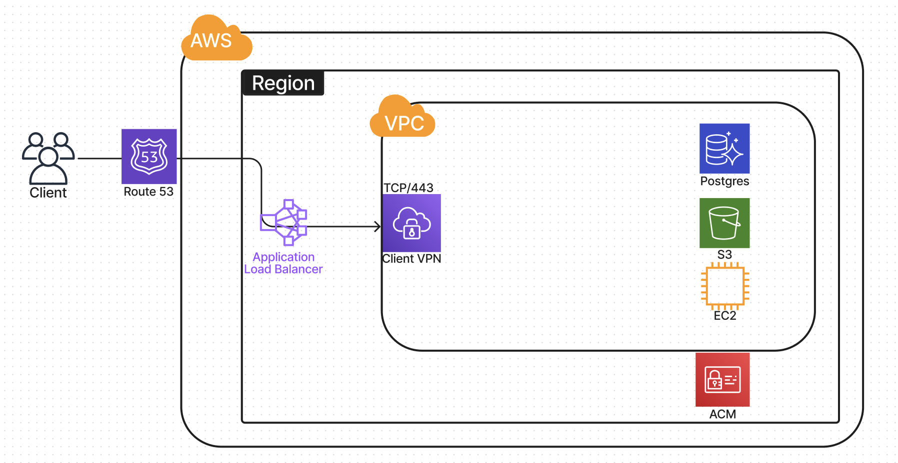

# System Design Documentation

## Components and Data Flow

### Client Access
- **Route 53**: Resolves domain names and routes requests.
- **Client VPN**: Provides secure connections over TCP/443.

### Load Balancing
- **Application Load Balancer**: Distributes requests across EC2 instances.

### Application Services
- **EC2 Instances**: Host application services.
- **PostgreSQL**: Manages relational data.
- **S3**: Stores objects and backups.

### Security
- **ACM**: Manages SSL/TLS certificates for secure communications.

